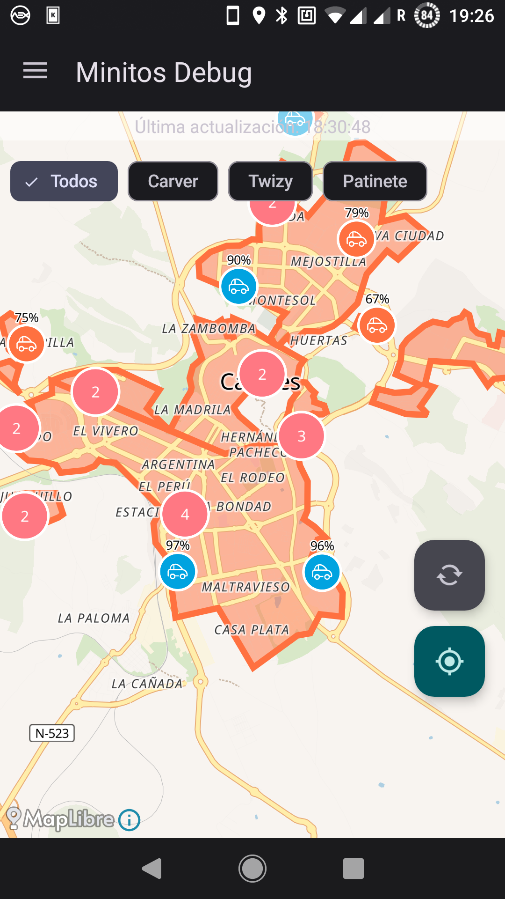
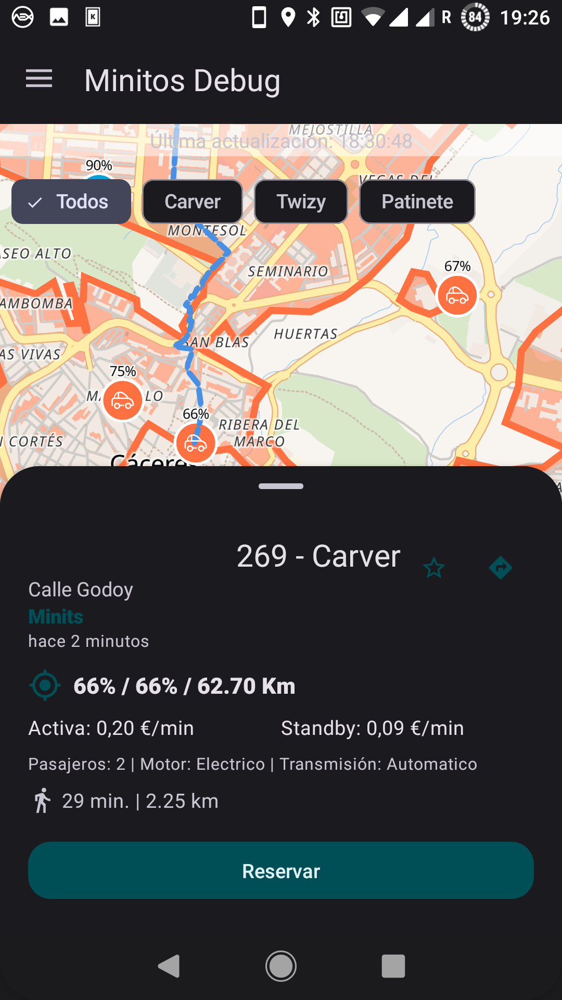
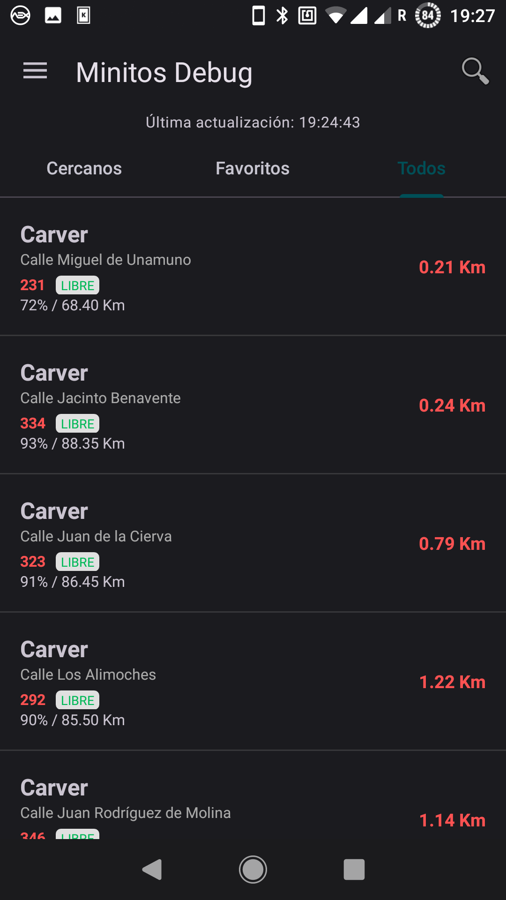
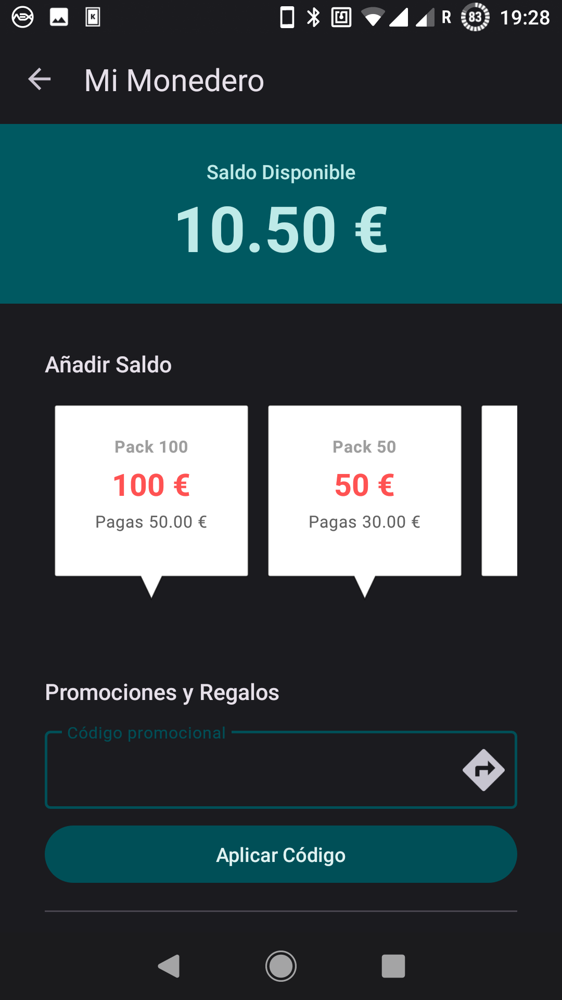
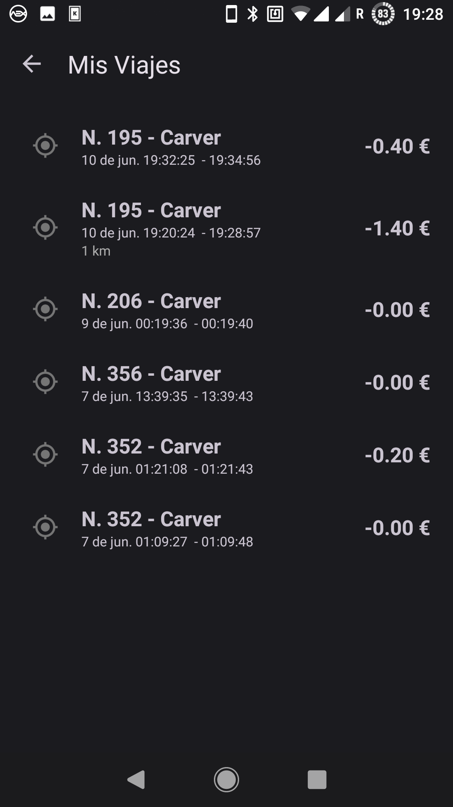
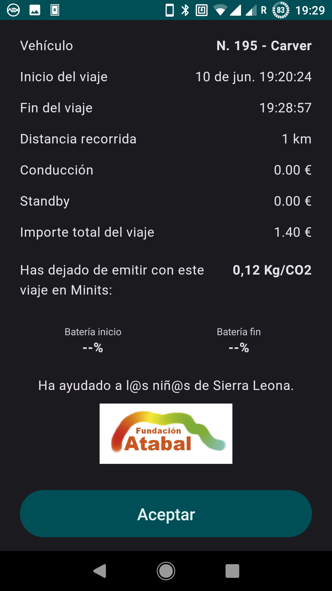

# Minitos

Minitos es un cliente de código abierto e independiente para el servicio de movilidad eléctrica Minits. 

Esta aplicación permite localizar vehículos, gestionar reservas y controlar tus viajes de forma fluida y moderna, sin depender de los servicios propietarios de Google y utilizando tecnologías 100% libres.

[](https://github.com/juanro49/Minitos/releases)

## Características

*   🗺️ **Mapas personalizables**: Mapas vectoriales gracias a **MapLibre Native**. Elige entre varios estilos de mapa (Liberty, Dark, Bright, Positron) servidos por **OpenFreeMap**.
*   🚗 **Gestión de Viajes**: Identificación y auto-selección automática de tu reserva activa al abrir la app.
*   💳 **Monedero Virtual**: Consulta tu saldo, compra paquetes de saldo con códigos promocionales y regala saldo a otros usuarios.
*   👤 **Perfil**: Gestión de datos personales y ubicaciones.
*   📸 **Reporte de Evidencias**: Captura y subida de fotos del estado del vehículo (delantera, trasera e interior) al finalizar el trayecto.
*   📊 **Historial de viajes**: Consulta trayectos pasados con desglose detallado de costes, ahorro de CO2, distancias y consumo de batería.
*   🌗 **Modo Oscuro**: Soporte nativo para temas claros y oscuros que respetan la configuración del sistema.
*   🔋 **Información Detallada**: Estado de batería, autonomía estimada y especificaciones de cada vehículo en tiempo real.
*   🚶 **Navegación Peatonal**: Visualiza en el mapa la ruta a pie hacia el vehículo seleccionado gracias a la integración con **OpenRouteService**.

## Capturas de Pantalla

<p align="center">
  
  
  
</p>
<p align="center">
  
  
  
</p>

## Construcción (Build)

Minitos es un proyecto estándar de Android Studio. Para compilarlo:

1.  Clona el repositorio.
2.  Ábrelo con **Android Studio**.
3.  Ejecuta la tarea `./gradlew assembleDebug` para generar el APK.

**Requisitos técnicos:**
*   **Min SDK**: 26 (Android 8.0 Oreo)
*   **Compile SDK**: 37 (Android 15)
*   **Java**: 21
*   **Arquitectura**: MVVM con Room y WorkManager.

## Privacidad y Filosofía

Minitos nace con la idea de ofrecer una alternativa libre que respeta la privacidad del usuario y que pueda ser usada en aquellos móviles que no poseen los Google Play Services. La aplicación no contiene rastreadores (trackers) y utiliza fuentes de mapas abiertas (OpenStreetMap/MapLibre).

> [!NOTE]
> **Registro de usuarios**: Por el momento, el registro de nuevas cuentas no está disponible desde Minitos. Para crear una cuenta, debes utilizar la aplicación oficial de Minits. Una vez creada, podrás iniciar sesión en Minitos sin problemas.

## Licencia

Este proyecto se distribuye bajo la licencia **GPLv3**.

[](https://opensource.org/license/gpl-3.0)

```text
Minitos. Cliente libre para Minits.
Copyright (C) 2026 Juanro

Basado originalmente en el proyecto BikeSharingHub:
Copyright (C) 2020-2024 François FERREIRA DE SOUSA
Que a su vez incorpora una versión modificada de OpenBikeSharing:
Copyright (C) 2014-2015 Bruno Parmentier

Minitos is free software: you can redistribute it and/or modify
it under the terms of the GNU General Public License as published by
the Free Software Foundation, either version 3 of the License, or
(at your option) any later version.

Minitos is distributed in the hope that it will be useful,
but WITHOUT ANY WARRANTY; without even the implied warranty of
MERCHANTABILITY or FITNESS FOR A PARTICULAR PURPOSE. See the
GNU General Public License for more details.
```

---
*Descargo de responsabilidad: Minitos es una aplicación independiente desarrollada por la comunidad y no está afiliada, asociada ni conectada oficialmente de ninguna manera con Minits MT S.A.*
